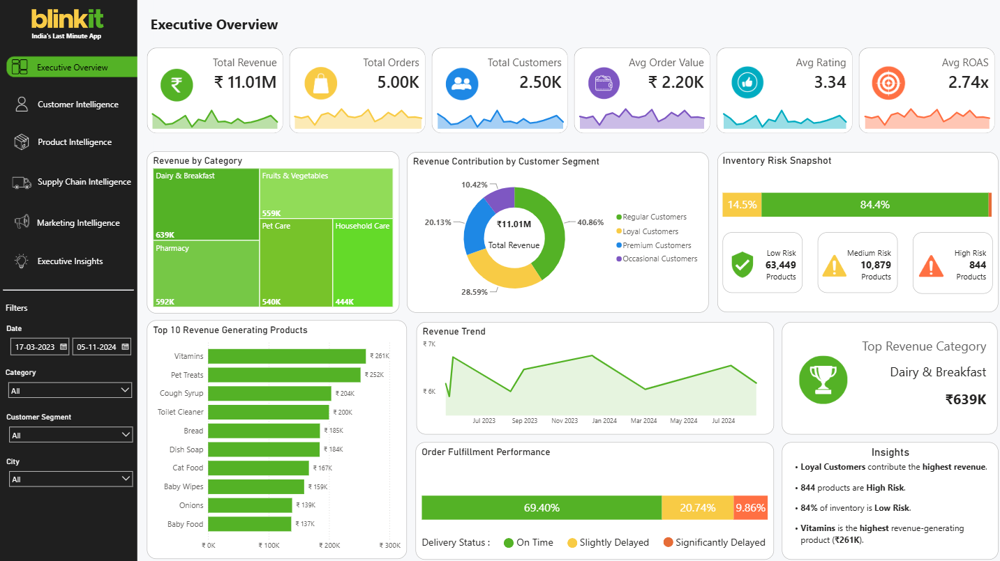
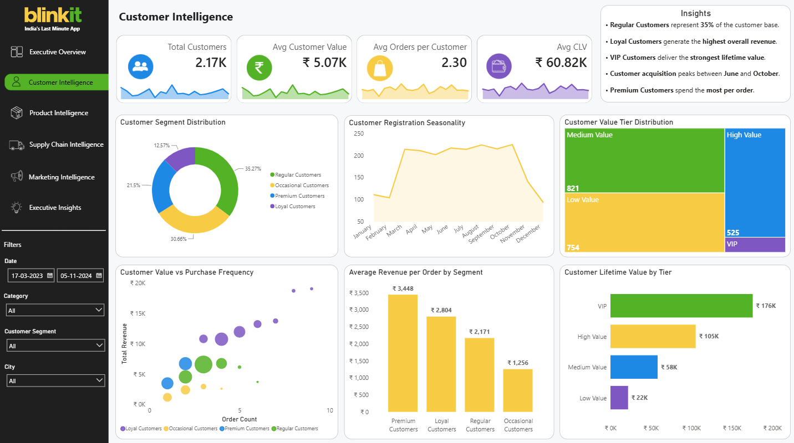
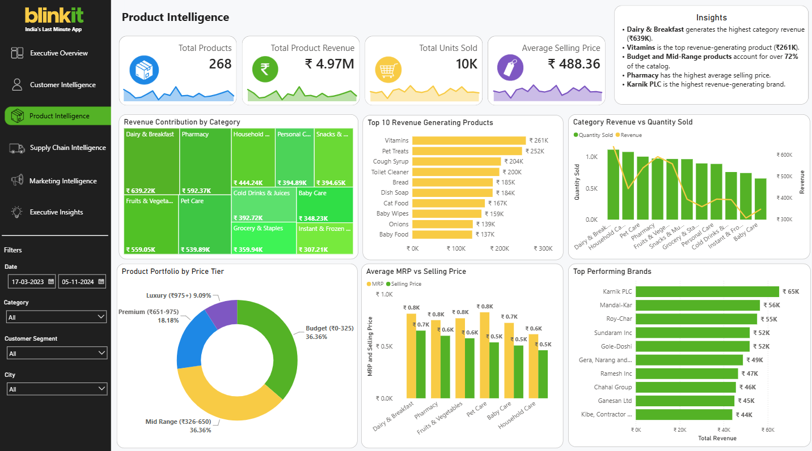
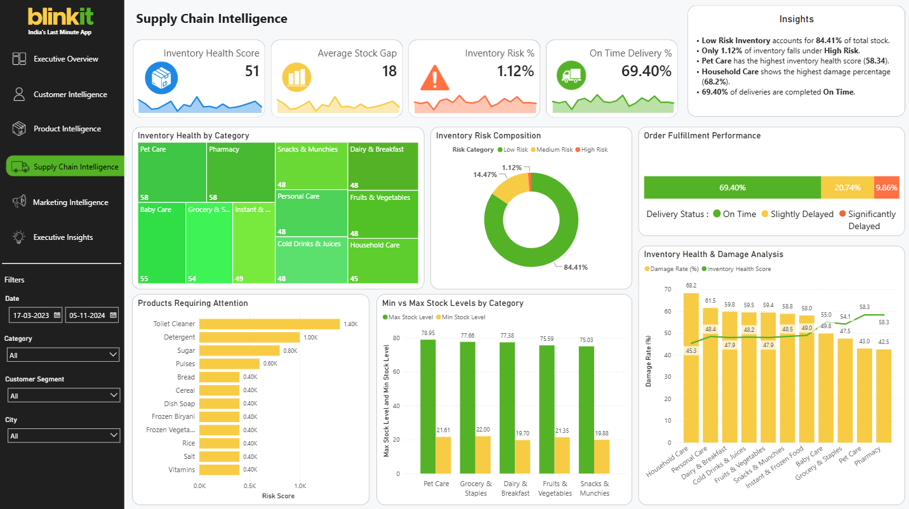
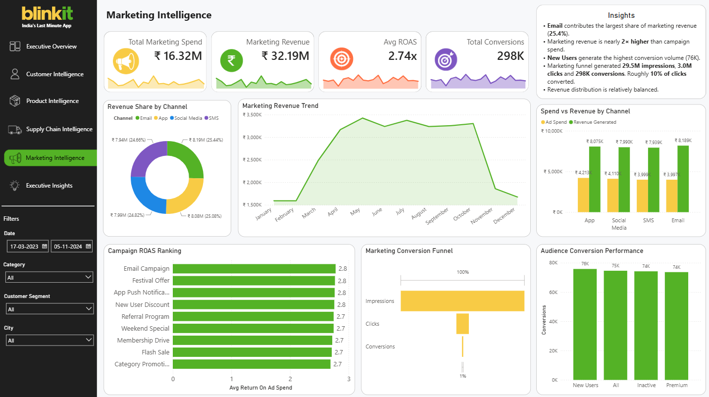
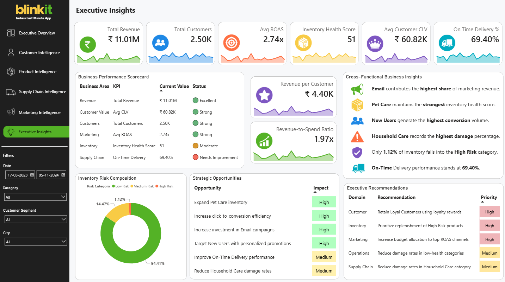

# Blinkit Retail Intelligence & Supply Chain Analytics Dashboard

## Overview

The **Blinkit Retail Intelligence & Supply Chain Analytics Dashboard** is a comprehensive end-to-end business intelligence solution designed to provide executive, customer, product, marketing, and supply chain insights from retail operations data.

Built using **Power BI**, **DAX**, and **Power Query**, the dashboard transforms retail transactional data into actionable business intelligence, enabling stakeholders to monitor performance, identify growth opportunities, optimize operations, evaluate marketing effectiveness, understand customer behavior, and support strategic decision-making.

The solution follows a multi-dimensional analytics approach by combining:

- Executive Performance Analysis
- Customer Intelligence
- Product Intelligence
- Supply Chain Intelligence
- Marketing Intelligence
- Cross-Functional Executive Insights

The dashboard is structured into six analytical modules, each designed to answer a specific set of business questions while maintaining a consistent executive reporting experience.

---

## Business Objectives

The primary objectives of this project are to:

- Provide a unified executive view of business performance
- Analyze customer purchasing behavior and lifetime value
- Identify high-performing products, brands, and categories
- Monitor inventory health and operational efficiency
- Evaluate marketing channel effectiveness and campaign performance
- Measure customer acquisition and conversion performance
- Identify inventory risks and supply chain bottlenecks
- Support data-driven decision making across business functions
- Generate actionable strategic recommendations
- Enable executives to monitor business performance from a single platform

---

## Business Questions Answered

### Executive Analytics

- How is the business performing overall?
- Which categories contribute the most revenue?
- What are the key operational risks affecting performance?

### Customer Analytics

- Which customer segments generate the highest value?
- What is the distribution of customers across value tiers?
- Which customer groups contribute the highest lifetime value?

### Product Analytics

- Which products, brands, and categories drive revenue?
- How does product pricing influence performance?
- Which areas of the product portfolio offer the greatest opportunity?

### Supply Chain Analytics

- Which categories have the healthiest inventory?
- Which products require immediate operational attention?
- How effectively are inventory and delivery operations performing?

### Marketing Analytics

- Which marketing channels generate the highest revenue?
- How efficiently are campaigns converting customers?
- Which campaigns deliver the strongest return on ad spend?

### Strategic Analytics

- What are the most significant cross-functional business insights?
- Which improvement opportunities should be prioritized?
- Where should executive teams focus future investments and actions?

---

## Analytical Capabilities

This project combines multiple analytical techniques to transform raw retail data into actionable business insights.

The solution includes:

- Executive KPI Analysis
- Customer Segmentation Analysis
- Customer Lifetime Value (CLV) Analysis
- Customer Behavior Analysis
- Product Performance Analysis
- Category Performance Analysis
- Brand Performance Analysis
- Inventory Health Assessment
- Inventory Risk Analysis
- Supply Chain Performance Analysis
- Marketing Channel Analysis
- Campaign ROAS Evaluation
- Marketing Funnel Analysis
- Market Basket Analysis
- Cross-Functional Business Insights
- Executive Insight & Recommendation Analysis

---

## Dashboard Modules

The dashboard consists of six integrated analytical pages:

1. Executive Overview
2. Customer Intelligence
3. Product Intelligence
4. Supply Chain Intelligence
5. Marketing Intelligence
6. Executive Insights

Together, these modules provide a complete 360° view of retail business performance.

---

## Tools & Technologies

### Business Intelligence

- Power BI
- DAX
- Power Query

### Data Processing

- Python
- Pandas
- NumPy
- Microsoft Excel
- Data Cleaning
- Feature Engineering
- Exploratory Data Analysis (EDA)

### Visualization & Reporting

- KPI Engineering
- Interactive Dashboards
- Business Intelligence Reporting
- Executive Reporting

### Version Control

- Git
- GitHub

---

## Dataset Overview

The project integrates multiple retail datasets covering customers, products, orders, inventory, marketing performance, delivery operations, and customer feedback.

### Raw Source Datasets

| Dataset | Description |
|----------|----------|
| blinkit_orders.csv | Order-level transaction data containing purchase information and order metrics |
| blinkit_order_items.csv | Product-level purchase details associated with customer orders |
| blinkit_customers.csv | Customer information used for segmentation and customer analytics |
| blinkit_products.csv | Product catalog containing category, pricing, and brand information |
| blinkit_inventory.csv | Inventory availability and stock management data |
| blinkit_inventoryNew.csv | Additional inventory dataset used for inventory health and risk analysis |
| blinkit_marketing_performance.csv | Marketing spend, campaign performance, revenue, conversions, and ROAS metrics |
| blinkit_delivery_performance.csv | Delivery and fulfillment performance data |
| blinkit_customer_feedback.csv | Customer ratings and feedback information |

### Analytical Outputs Generated

The project generates multiple analytical datasets during processing and feature engineering, including:

- Customer Segmentation Outputs
- Customer Lifetime Value (CLV) Analysis
- Market Basket Analysis Outputs
- Inventory Health & Risk Analysis
- Marketing Performance Summaries
- Executive KPI Tables
- Recommendation Framework Datasets
- Cross-Functional Business Insight Tables

These processed datasets are used to power the final Power BI reporting layer and executive dashboards.

---

## Key Business Domains Covered

| Domain | Focus Area |
|----------|----------|
| Executive Analytics | Business-wide performance monitoring |
| Customer Analytics | Customer behavior, segmentation, CLV |
| Product Analytics | Category, product, and brand performance |
| Supply Chain Analytics | Inventory health, fulfillment, risk monitoring |
| Marketing Analytics | Campaign effectiveness, ROAS, conversions |
| Strategic Intelligence | Cross-functional insights and recommendations |

---

## Data Processing Pipeline

The project follows a structured analytics workflow:

1. Data Collection
2. Data Cleaning & Validation
3. Exploratory Data Analysis (EDA)
4. Feature Engineering
5. Customer Segmentation
6. Customer Lifetime Value Analysis
7. Market Basket Analysis
8. Supply Chain Analytics
9. KPI Engineering
10. Power BI Data Modeling
11. Dashboard Development
12. Executive Insight Generation

This workflow transforms raw retail datasets into actionable business intelligence and strategic recommendations.

---

# Dashboard Walkthrough

---

# Executive Overview



<p align="center"><b>Figure 1:</b> Executive Overview Dashboard</p>

### Purpose

The Executive Overview page serves as the primary business performance summary page and provides a consolidated view of revenue, customers, orders, inventory risk, and operational performance.

### KPI Summary

- Total Revenue
- Total Orders
- Total Customers
- Average Order Value
- Average Rating
- Average ROAS

### Visual Analysis

#### Revenue by Category

A treemap visualization highlighting revenue contribution across product categories and identifying the highest revenue-generating segments.

#### Revenue Contribution by Customer Segment

A donut chart displaying revenue distribution across customer segments including:

- Regular Customers
- Loyal Customers
- Premium Customers
- Occasional Customers

#### Inventory Risk Snapshot

Provides a quick breakdown of:

- Low Risk Products
- Medium Risk Products
- High Risk Products

allowing management to assess overall inventory exposure.

#### Top Revenue Generating Products

Ranks products based on revenue contribution and highlights the strongest performing items.

#### Revenue Trend

Tracks revenue performance across time and identifies business growth patterns.

#### Order Fulfillment Performance

Displays delivery performance distribution across:

- On-Time Deliveries
- Slightly Delayed Deliveries
- Significantly Delayed Deliveries

### Key Insights

- Dairy & Breakfast is the highest revenue-generating category.
- Loyal Customers contribute the largest share of revenue.
- Inventory exposure remains heavily concentrated within Low Risk products.
- The top revenue-generating products contribute a significant share of total revenue.
- Approximately 69% of deliveries are completed on time.

---

# Customer Intelligence



<p align="center"><b>Figure 2:</b> Customer Intelligence Dashboard</p>

### Purpose

The Customer Intelligence page focuses on customer segmentation, spending behavior, purchasing frequency, and lifetime value analysis.

### KPI Summary

- Total Customers
- Average Customer Value
- Average Orders per Customer
- Average Customer Lifetime Value (CLV)

### Visual Analysis

#### Customer Segment Distribution

Analyzes the composition of the customer base across:

- Regular Customers
- Occasional Customers
- Premium Customers
- Loyal Customers

#### Customer Registration Seasonality

Tracks customer acquisition trends across months and identifies seasonal registration patterns.

#### Customer Value Tier Distribution

Segments customers into:

- Low Value
- Medium Value
- High Value
- VIP

allowing businesses to understand customer concentration by value.

#### Customer Value vs Purchase Frequency

A bubble chart analyzing the relationship between:

- Purchase Frequency
- Revenue Contribution
- Customer Segment

This helps identify high-value and high-frequency customer groups.

#### Average Revenue per Order by Segment

Compares average order revenue across customer segments.

#### Customer Lifetime Value by Tier

Evaluates long-term customer value and identifies the most profitable customer tiers.

### Key Insights

- Loyal Customers generate the highest overall revenue.
- VIP Customers contribute the highest customer lifetime value.
- Premium Customers spend the most per order.
- Customer registrations peak between March and October, indicating stronger customer acquisition during this period.
- Customer value is concentrated among higher-value segments.

---

# Product Intelligence



<p align="center"><b>Figure 3:</b> Product Intelligence Dashboard</p>

### Purpose

The Product Intelligence page evaluates category performance, pricing effectiveness, product profitability, and brand performance.

### KPI Summary

- Total Products
- Total Product Revenue
- Total Units Sold
- Average Selling Price

### Visual Analysis

#### Revenue Contribution by Category

A treemap visualization showing revenue contribution across major retail categories.

#### Top Revenue Generating Products

Ranks the highest-performing products based on total revenue generated.

#### Category Revenue vs Quantity Sold

A combo chart comparing:

- Revenue
- Quantity Sold

to evaluate demand efficiency by category.

#### Product Portfolio by Price Tier

Analyzes the distribution of products across:

- Budget
- Mid Range
- Premium
- Luxury

price segments.

#### Average MRP vs Selling Price

Compares listed prices against actual selling prices to evaluate pricing strategy effectiveness.

#### Top Performing Brands

Ranks brands according to revenue contribution.

### Key Insights

- Dairy & Breakfast generates the highest category revenue.
- Vitamins are the top revenue-generating product.
- Budget and Mid-Range products dominate the portfolio.
- Pharmacy maintains the highest average selling price.
- Revenue contribution is concentrated among a small group of brands.

---

# Supply Chain Intelligence



<p align="center"><b>Figure 4:</b> Supply Chain Intelligence Dashboard</p>

### Purpose

The Supply Chain Intelligence page focuses on inventory health, operational efficiency, inventory risks, stock management, and delivery performance.

### KPI Summary

- Inventory Health Score
- Average Stock Gap
- Inventory Risk Percentage
- On-Time Delivery Percentage

### Visual Analysis

#### Inventory Health by Category

A treemap displaying inventory health performance across product categories.

#### Inventory Risk Composition

Shows the percentage distribution of:

- Low Risk Inventory
- Medium Risk Inventory
- High Risk Inventory

#### Order Fulfillment Performance

Measures delivery execution across:

- On Time
- Slightly Delayed
- Significantly Delayed

categories.

#### Products Requiring Attention

Identifies products with the highest operational risk scores and inventory concerns.

#### Min vs Max Stock Levels by Category

Compares minimum and maximum inventory levels to assess stock planning effectiveness.

#### Inventory Health & Damage Analysis

A combined analysis comparing:

- Damage Rate
- Inventory Health Score

across categories to identify operational inefficiencies.

### Key Insights

- Low Risk Inventory accounts for the majority of inventory.
- High Risk Inventory represents only a small fraction of stock.
- Pet Care maintains the strongest inventory health score.
- Household Care records the highest damage rate.
- Approximately 30% of deliveries experience delays, highlighting an opportunity to improve fulfillment efficiency.

---

# Marketing Intelligence



<p align="center"><b>Figure 5:</b> Marketing Intelligence Dashboard</p>

### Purpose

The Marketing Intelligence page evaluates channel performance, campaign effectiveness, marketing ROI, and customer conversion efficiency.

### KPI Summary

- Total Marketing Spend
- Marketing Revenue
- Average ROAS
- Total Conversions

### Visual Analysis

#### Revenue Share by Channel

Analyzes revenue contribution across marketing channels:

- Email
- App
- Social Media
- SMS

#### Marketing Revenue Trend

Tracks monthly marketing-driven revenue performance and identifies seasonality patterns.

#### Spend vs Revenue by Channel

Compares marketing investment against generated revenue for each channel.

#### Campaign ROAS Ranking

Ranks campaigns based on Return on Ad Spend (ROAS).

#### Marketing Conversion Funnel

Visualizes the marketing journey from:

- Impressions
- Clicks
- Conversions

allowing conversion leakage analysis.

#### Audience Conversion Performance

Compares conversion volume across audience segments.

### Key Insights

- Email generates the largest share of marketing revenue.
- Revenue generated significantly exceeds campaign spend across channels.
- Top-performing campaigns achieve ROAS values exceeding 2.7x.
- New Users contribute the highest conversion volume.
- The largest performance drop occurs between clicks and conversions.

---

# Executive Insights



<p align="center"><b>Figure 6:</b> Executive Insights Dashboard</p>

### Purpose

The Executive Insights page consolidates critical metrics and observations from all business functions into a single executive decision-support layer.

Unlike the Executive Overview page, which focuses on performance monitoring, this page focuses on strategic interpretation and actionable recommendations.

### KPI Summary

- Total Revenue
- Total Customers
- Average ROAS
- Inventory Health Score
- Average Customer CLV
- On-Time Delivery %

### Visual Analysis

#### Business Performance Scorecard

Summarizes business performance across:

- Revenue Performance
- Customer Value
- Customer Base
- Marketing Efficiency
- Inventory Health
- Supply Chain Performance

using business status indicators.

#### Revenue per Customer

Measures customer monetization efficiency.

#### Revenue-to-Spend Ratio

Evaluates overall business return relative to expenditure.

#### Cross-Functional Business Insights

Highlights the most important findings across:

- Marketing
- Customer Analytics
- Inventory Management
- Supply Chain Performance

#### Inventory Risk Composition

Provides a high-level inventory exposure summary.

#### Strategic Opportunities

Identifies business opportunities categorized by impact level.

#### Executive Recommendations

Provides prioritized recommendations across:

- Customer Strategy
- Inventory Management
- Marketing
- Operations
- Supply Chain

### Key Insights

- Marketing, customer, and operational metrics can be evaluated together.
- The business generates approximately ₹1.97 in revenue for every ₹1 spent.
- Inventory risk remains controlled despite category-level challenges.
- Customer acquisition and retention remain key growth drivers.
- Strategic opportunities are prioritized based on business impact.

---

## Key KPIs Tracked

| KPI | Description |
|----------|----------|
| Total Revenue | Total revenue generated across all business operations |
| Total Orders | Total customer orders processed |
| Total Customers | Unique customer count |
| Average Order Value | Revenue generated per order |
| Average Rating | Customer satisfaction indicator |
| Average CLV | Customer Lifetime Value |
| Average ROAS | Return on Ad Spend |
| Inventory Health Score | Overall inventory performance metric |
| Inventory Risk % | Percentage of inventory classified as high risk |
| On-Time Delivery % | Delivery efficiency indicator |
| Total Marketing Spend | Total advertising expenditure |
| Marketing Revenue | Revenue generated through marketing channels |
| Total Conversions | Successful customer conversions |
| Revenue per Customer | Average revenue generated per customer |
| Revenue-to-Spend Ratio | Overall business efficiency metric |

---

## Design Principles Followed

The dashboard was designed using modern business intelligence and executive reporting principles:

- Executive-focused KPI design
- Consistent visual hierarchy
- Application-style page navigation
- Cross-functional business storytelling
- High information density with minimal clutter
- Consistent color system across modules
- Insight-driven dashboard design
- Strategic decision-support orientation
- Business-friendly visual structure
- Executive reporting best practices

---

## Project Structure

```text
Blinkit Retail Intelligence & Supply Chain Analytics Dashboard/
│
├── data/
│   ├── blinkit_orders.csv
│   ├── blinkit_order_items.csv
│   ├── blinkit_customers.csv
│   ├── blinkit_products.csv
│   ├── blinkit_inventory.csv
│   ├── blinkit_inventoryNew.csv
│   ├── blinkit_marketing_performance.csv
│   ├── blinkit_delivery_performance.csv
│   └── blinkit_customer_feedback.csv
│
├── exports/
│   ├── cleaned_data/
│   ├── processed_data/
│   ├── segmentation_output/
│   ├── basket_analysis_output/
│   ├── supply_chain_output/
│   ├── executive_output/
│   └── powerbi_sources/
│
├── notebooks/
│   ├── 01_data_cleaning.ipynb
│   ├── 02_eda.ipynb
│   ├── 03_feature_engineering.ipynb
│   ├── 04_customer_segmentation.ipynb
│   ├── 05_market_basket_analysis.ipynb
│   ├── 06_clv_analysis.ipynb
│   ├── 07_supply_chain_analysis.ipynb
│   └── 08_executive_recommendations.ipynb
│
├── powerbi/
│   └── Blinkit Retail Intelligence & Supply Chain Analytics.pbix
│
├── screenshots/
│   ├── Executive_Overview.png
│   ├── Customer_Intelligence.png
│   ├── Product_Intelligence.png
│   ├── Supply_Chain_Intelligence.png
│   ├── Marketing_Intelligence.png
│   └── Executive_Insights.png
│
└── README.md
```

---

## Skills Demonstrated

### Data Analytics

- Python
- Pandas
- NumPy
- Data Cleaning
- Exploratory Data Analysis (EDA)
- Data Transformation
- Feature Engineering
- Business KPI Development

### Customer Analytics

- Customer Segmentation
- Customer Lifetime Value (CLV) Analysis
- Customer Behavior Analysis
- Customer Value Tier Analysis

### Retail Analytics

- Product Performance Analysis
- Category Performance Analysis
- Brand Performance Analysis
- Market Basket Analysis

### Supply Chain Analytics

- Inventory Health Assessment
- Inventory Risk Analysis
- Stock Level Analysis
- Fulfillment Performance Analysis

### Marketing Analytics

- Marketing Channel Performance Analysis
- Campaign ROAS Analysis
- Conversion Funnel Analysis
- Customer Acquisition Analysis

### Business Intelligence

- Power BI Dashboard Development
- Data Modeling
- DAX
- Power Query
- Executive Reporting
- Data Storytelling
- Strategic Insight Generation

---

## Business Value

This dashboard demonstrates how business intelligence can be leveraged to create a unified decision-support system across multiple business functions.

The solution enables organizations to:

- Monitor overall business performance
- Understand customer behavior and value
- Evaluate product and category profitability
- Improve inventory planning and operational visibility
- Measure marketing effectiveness
- Identify growth opportunities
- Detect operational inefficiencies
- Prioritize executive actions
- Support strategic planning
- Drive data-informed decision making

---

## Conclusion

The **Blinkit Retail Intelligence & Supply Chain Analytics Dashboard** provides a complete retail intelligence ecosystem by integrating executive reporting, customer analytics, product performance analysis, supply chain monitoring, marketing intelligence, and strategic business insights into a single Power BI solution.

The dashboard goes beyond traditional reporting by connecting multiple business functions into a unified analytical framework. It enables stakeholders to understand not only what is happening across the business, but also why it is happening and where future opportunities exist.

Through a combination of KPI engineering, interactive visualizations, cross-functional insights, and executive recommendations, the solution demonstrates how modern business intelligence can support operational excellence, strategic growth, and data-driven decision making.

---

## Author

**Srajan V N**

---

## License

This project is intended for educational, portfolio, and learning purposes.

---

## GitHub Topics

```text
power-bi
power-query
dax
business-intelligence
retail-analytics
customer-analytics
customer-segmentation
market-basket-analysis
marketing-analytics
supply-chain-analytics
product-analytics
executive-dashboard
data-analytics
dashboard-design
```